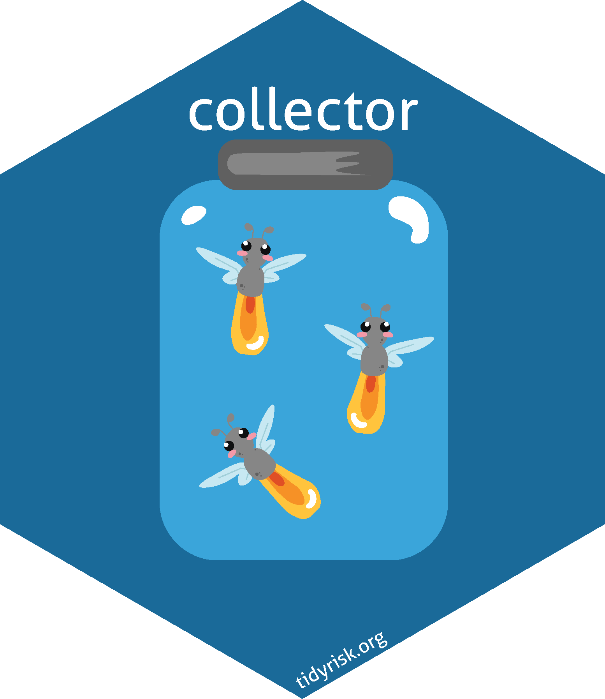

<!-- README.md is generated from README.Rmd. Please edit that file -->

```{r setup, include = FALSE}
knitr::opts_chunk$set(
  collapse = TRUE,
  comment = "#>",
  fig.path = "man/figures/README-",
  out.width = "100%"
)
```
# collector <a href="https://collector.tidyrisk.org"></a>

<!-- badges: start --> 
[](https://travis-ci.org/davidski/collector)
[](https://ci.appveyor.com/project/davidski/collector)
[](https://codecov.io/github/davidski/collector?branch=master)
[](https://cran.r-project.org/package=colector)

<!-- badges: end --> 

**collector** is an R package for conducting interviews with subject matter 
experts (SMEs) on the risk scenarios facing an organization. It offers 
functions for the following stages of input collection:

 - generate scenario and capability questions
 - building interview artifacts, including progress card, slide decks, and handouts
 - calibration testing, similar to that promoted by Doug Hubbard and the FAIR Institute
 - distribution fitting
 - opinion pooling of multiple SMEs into a single representative distribution
 - generating quantitative risk scenarios for simulation and reporting by [Evaluator](https://evaluator.tidyrisk.org)

## Installation

Collector is not yet on CRAN. The following sample code will not work until a 
CRAN release is available.

```{r install_cran, eval=FALSE}
install.packages("collector")
```

If you wish to run the development (and potentially bleeding edge) version, 
you can install directly from GitHub via the following `devtools` command.

```{r github_install, eval=FALSE}
# install.pacakges("devtools")
devtools::install_github("davidski/collector")
```

## Basic Flow

See the [package website](https://collector.tidyrisk.org) for 
reference. The basic flow for preparing for interviews with your SMEs, 
processing the results, and generating parameters for simulation via 
[evaluator](https://evaluator.tidyrisk.org) is:

1. Build questions and define SME expertise

2. Read in the question set. See `read_questions()` for more information.

    ```{r, eval=FALSE}
    library(collector)
   
    questions <- read_questions()
    ```
   
3. Generate materials for interviewing a SME.

    ```{r, eval=FALSE}
    output_dir <- tempdir()
    make_handouts("Leader Name", questions, output_dir)
    make_scorecard("Leader Name", questions, output_dir)
    make_slides("Leader Name", questions, output_dir)
    ```
    
4. Read in the responses from your SMEs. See `read_responses()` documentation 
   for more information.

    ```{r, eval=FALSE}
    responses <- read_responses()
    ```

5. Fit the SME answers to distributions.

    ```{r, eval=FALSE}
    scenario_answers_fitted <- fit_scenarios(responses)
    capability_answers_fitted <- fit_capabilities(responses)
    ```
    
6. Combine distributions into final parameters, applying weighting based on 
    each SMEs level of calibration.

    ```{r eval=FALSE}
    sme_weightings <- generate_weights(questions, responses)
    scenario_parameters <- left_join(scenario_answers_fitted, sme_weightings, by = "sme") %>% 
      combine_scenario_parameters()
    capability_parameters <- left_join(capability_answers_fitted, sme_weightings, by = "sme") %>% 
      combine_capability_parameters()
    ```
    
7. Build quantitative scenarios for [evaluator](https://evaluator.tidyrisk.org).

    ```{r eval=FALSE}
    scenarios <- prepare_data(scenario_parameters, capability_parameters, 
                              threat_parameters, questions)
    ```

## Contributing

This project is governed by a [Code of Conduct](CODE_OF_CONDUCT.md). By 
participating in this project you agree to abide by these terms.

## License

The [MIT License](LICENSE) applies.
