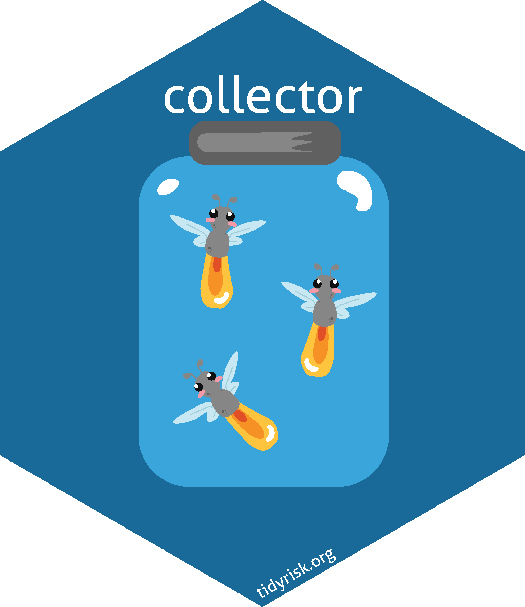

<!-- README.md is generated from README.Rmd. Please edit that file -->

# collector <a href="https://collector.tidyrisk.org"></a>

<!-- badges: start -->

[](https://travis-ci.org/davidski/collector)
[](https://ci.appveyor.com/project/davidski/collector)
[](https://codecov.io/github/davidski/collector?branch=master)
[](https://cran.r-project.org/package=colector)

<!-- badges: end -->

**collector** is an R package for conducting interviews with subject
matter experts (SMEs) on the risk scenarios facing an organization. It
offers functions for the following stages of input collection:

  - generate scenario and capability questions
  - building interview artifacts, including progress card, slide decks,
    and handouts
  - calibration testing, similar to that promoted by Doug Hubbard and
    the FAIR Institute
  - opinion pooling
  - distribution fitting
  - generating quantitative data structures for simulation and further
    reporting by [Evaluator](https://evaluator.tidyrisk.org)

## Installation

Collector is not currently on CRAN. The following sample code to install
will not work until a release is made to CRAN.

``` r
install.packages("collector")
```

If you wish to run the development (and potentially bleeding edge)
version of Collector, you can install directly from GitHub via the
following `devtools` command.

``` r
# install.pacakges("devtools")
devtools::install_github("davidski/collector")
```

## Basic Flow

See the [package website](https://collector.tidyrisk.org) for reference.
While long form vignettes need to be created, the basic flow for
preparing for interviews with your SMEs, processing the results, and
generating parameters for simulation via
[evaluator](https://evaluator.tidyrisk.org) is:

1.  Build questions and define SME expertise

2.  Read in the questions
    
    ``` r
    library(collector)
    
    questions <- read_questions()
    ```

3.  Generate materials for interviewing a SME
    
    ``` r
    make_handouts("Leader Name", questions, output_dir)
    make_scorecard("Leader Name", questions, output_dir)
    make_slides("Leader Name", questions, output_dir)
    ```

4.  Read in the answers from your SMEs
    
    ``` r
    answers <- read_answers()
    ```

5.  Fit the SME answers to distributions.
    
    ``` r
    scenario_answers_fitted <- fit_scenarios(answers)
    capability_answers_fitted <- fit_capabilities(answers)
    ```

6.  Combine distributions into final parameters, applying weighting
    based on each SMEs level of calibration.
    
    ``` r
    sme_weightings <- generate_weights(questions, answers)
    scenario_parameters <- left_join(scenario_answers_fitted, sme_weightings, by = "sme") %>% 
      combine_scenario_parameters()
    capability_parameters <- left_join(capability_answers_fitted, sme_weightings, by = "sme") %>% 
      combine_capability_parameters()
    ```

7.  Build quantitative parameters for `evaluator`
    
    ``` r
    scenarios <- prepare_data(scenario_parameters, capability_parameters, 
                              threat_parameters, questions)
    ```

## Contributing

This project is governed by a [Code of Conduct](CODE_OF_CONDUCT.md). By
participating in this project you agree to abide by these terms.

## License

The [MIT License](LICENSE) applies.
